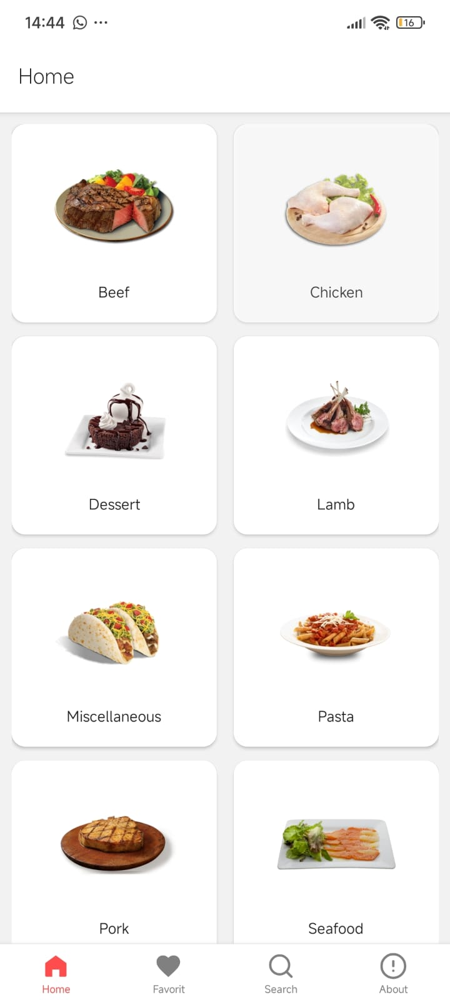
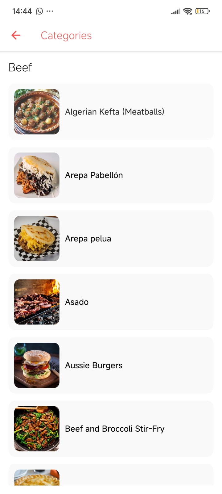
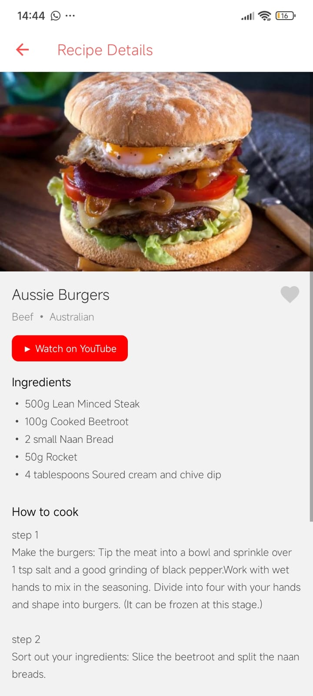
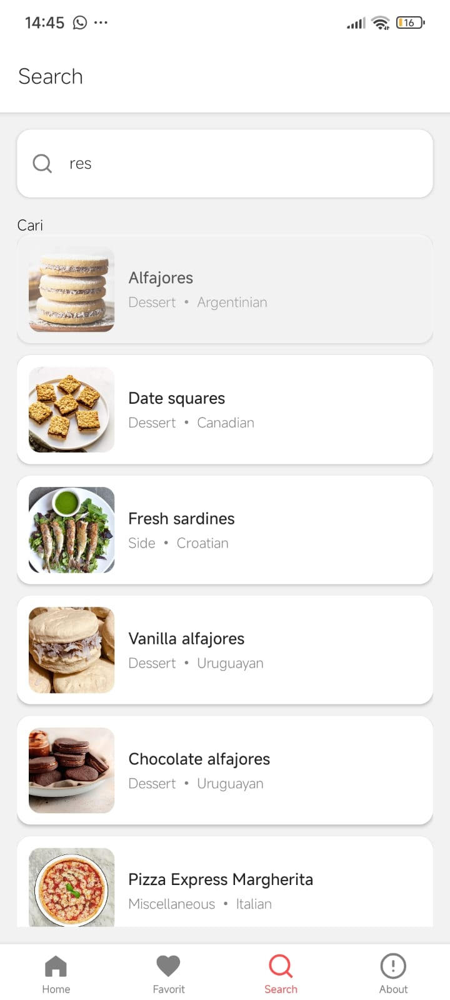
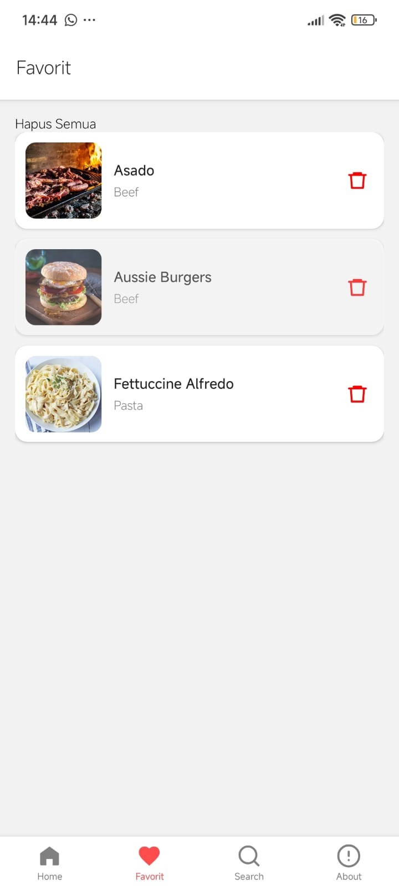
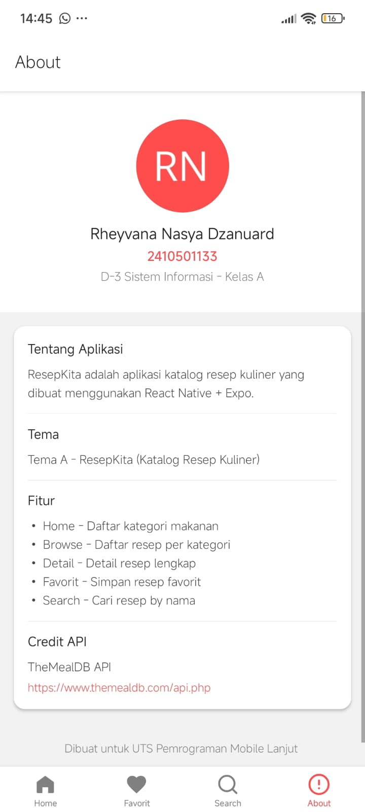

# RESEP KITA

Aplikasi katalog resep kuliner berbasis React Native dan Expo.

Nama: Rheyvana Nasya Dzanuard
NIM: 2410501133
Kelas: A (D3 Sistem Informasi)
Mata Kuliah: Pemograman Moile Lanjut

## TEMA PROYEK
Tema A: ResepKita (Katalog Resep Kuliner)
Aplikasi ini dibuat untuk menampilkan berbagai resep makanan dari API eksternal dengan fitur pencarian, detail resep, dan penyimpanan favorit.

## Tech Stack
Berikut adalah library dan framework yang digunakan dalam pengembangan aplikasi ResepKita:
------------------------------
Library / Framework | Versi
------------------------------
React Native        | 0.81.5
Expo                | ~54.0.33
React Navigation    | ^7.x
Axios               | ^1.15.2
Zustand             | ^5.0.12

## Cara Install dan Menjalankan Project
bash
### Clone repository
git clone https://github.com/rheyvana2410501133-png/uts-mobile-lanjut2410501133-rheyvananasyadzanuard
### Masuk ke folder project
cd uts-mobile-lanjut-rheyvana
### Install dependency
npm install
### Jalankan project
npx expo start
### Setelah server berjalan, scan QR Code menggunakan aplikasi Expo Go pada smartphone.

## Fitur Utama Aplikasi
Menampilkan daftar resep makanan dari API
Melihat detail resep secara lengkap
Mencari resep berdasarkan kata kunci
Menambahkan / menghapus resep ke daftar favorit
Pull to refresh pada halaman daftar resep
Error handling ketika koneksi / API bermasalah
Halaman About sebagai informasi aplikasi dan developer

## Screenshot Aplikasi
|  |  |  |
|  |  |  |

## Video Demo
> [https://youtu.be/M5lrd35rqbk?si=ozm4Hrr9wYWGMSz-](youtube)
> [https://drive.google.com/drive/folders/1QKAAmHOanU1wAAHnngFt2_NuiBz5XkKG?usp=sharing](Gdrive)

## State Management Zustand
Aplikasi ini menggunakan Zustand untuk mengelola data resep favorit secara global. 
Dengan Zustand, data favorit dapat diakses dari berbagai screen tanpa perlu 
melakukan prop drilling antar komponen.
### Fitur yang dikelola melalui Zustand meliputi:
- Menambahkan resep ke daftar favorit
- Menghapus resep dari daftar favorit
- Menampilkan seluruh resep favorit pada halaman Favorites
- Mengosongkan daftar favorit jika diperlukan

# Referensi
[State Management Dengan Zustand](https://youtu.be/IMckci9_9yc?si=XCyApmep03BMrg4n)
[Setup React JS](https://youtu.be/3Jgju76gS2g?si=KhT4lPoMaKgPxYWk)
[Cara Commit dan Push ke GitHub](https://youtu.be/ehbGf5khnso?si=Xv1ad3IMQizjAZuy)
[Build Food Recipe App in React Native Reanimated](https://youtu.be/cdnneQjsoT0?si=OxSswMmaGALokPpG)
[Deliveroo Food Ordering Clone with React Native](https://youtu.be/FXnnCrfiNGM?si=QzeEhnUXS-HEo_Ct)

# Kendala dan Pembelajaran
Selama proses pengerjaan aplikasi ResepKita, saya mengalami beberapa kendala pada navigasi antar screen dan pengelolaan state favorit menggunakan Zustand. Saya sempat mengalami error ketika menghubungkan navigasi bottom tab dengan stack navigator pada awal implementasi karena struktur file dan konfigurasi route yang belum tepat. Selain itu, terdapat bug pada fitur favorit di mana data resep yang ditambahkan tidak langsung update pada halaman Favorite.
Kendala lain muncul saat mengintegrasikan data dari API TheMealDB, khususnya ketika menangani kondisi loading, error, dan data kosong. Saya perlu beberapa kali melakukan debugging untuk memastikan aplikasi tetap stabil ketika koneksi internet lambat atau API gagal merespons.
Dari pengerjaan proyek ini, saya belajar lebih dalam mengenai struktur project React Native yang rapi, cara mengelola state global menggunakan Zustand, serta pentingnya handling error untuk meningkatkan pengalaman pengguna. Saya juga memahami bagaimana membangun aplikasi mobile yang modular dengan memisahkan komponen, screen, dan service API agar kode lebih mudah dikelola. Secara keseluruhan, proyek ini membantu saya memahami alur pengembangan aplikasi mobile dari tahap perancangan hingga implementasi fitur secara nyata.